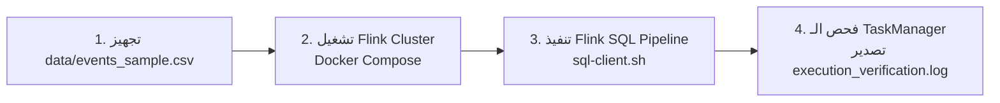

# CartStream Analytics: Real-Time E-Commerce Stream Processing Pipeline
## Apache Flink SQL & Windowing TVFs (Samsung Innovation Campus - Task #26)

---

## 📌 1. نظرة عامة على المشروع (Project Overview & Scenario)

يهدف هذا المشروع إلى بناء خط معالجة بيانات فوري (**Real-Time Stream Processing Pipeline**) لصالح منصة **CartStream Analytics** المسؤولة عن المراقبة الحية والتحليلات لمتجر إلكتروني دولي للتجارة الإلكترونية.

تستقبل المنصة دفقاً مستمراً من تفاعلات المستخدمين (تصفح منتجات `view`، إضافة للسلة `cart`، إزالة من السلة `remove_from_cart`، وشراء `purchase`). وبصفتك **Junior Data Platform Engineer**، المطلوب منك:
1. بناء **Streaming Source Table** باستخدام **Apache Flink SQL**.
2. تطبيق استراتيجية توقيت الحدث (**Event Time Processing**) وعلامات التزامن (**Watermarks**).
3. تحليل بيانات المبيعات الحية كل 5 دقائق باستخدام **Modern Windowing Table-Valued Functions (Windowing TVFs)**.
4. حساب مقاييس الأعمال (إجمالي الطلبات، الإيرادات، متوسط قيمة الطلب، والمشترين الفريدين).
5. توجيه المخرجات إلى جدول مخرجات (**Sink Table**) لتغذية لوحات المتابعة الحية (**Dashboards**).

---

## 🎯 2. تفاصيل المهام المطلوبة (Graduated Sub-Tasks Breakdown)

### 🔹 المهمة الأولى: جدول المصدر وعلامات التزامن (Task 1: Source DDL & Watermarking)
1. **إنشاء جدول المصدر `ecommerce_events`**:
   - قراءة الأحداث المتدفقة بصيغة CSV أو JSON.
   - تحديد الحقول الأساسية:
     - `event_time_str`: التوقيت الأصلي كنص (`VARCHAR`).
     - `event_time`: عمود محسوب يُحول النص إلى وقت فعلي بصيغة `TIMESTAMP(3)` باستخدام الدالة:
       ```sql
       TO_TIMESTAMP(event_time_str, 'yyyy-MM-dd HH:mm:ss z')
       ```
     - `event_type`: نوع الحدث (`view`, `cart`, `remove_from_cart`, `purchase`).
     - `product_id`: معرف المنتج (`BIGINT`).
     - `category_id`: معرف فئة المنتج (`BIGINT`).
     - `category_code`: التصنيف التكتيكي للمنتج (`VARCHAR`).
     - `brand`: العلامة التجارية (`VARCHAR`).
     - `price`: سعر المنتج (`DECIMAL(10, 2)`).
     - `user_id`: معرف العميل الدائم (`BIGINT`).
     - `user_session`: معرف الجلسة المؤقت للمستخدم (`VARCHAR`).
2. **ضبط معالجة توقيت الحدث (Event Time Strategy)**:
   - تحديد Watermark بتأخير مسموح قدره 5 ثوانٍ:
     ```sql
     WATERMARK FOR event_time AS event_time - INTERVAL '5' SECOND
     ```
3. **شرح نظري لـ Watermark (Theoretical Question)**:
   - شرح كيف تضمن عتبة الـ 5 ثوانٍ معالجة حتمية ودقيقة للنوافذ الزمنية عند وصول الأحداث غير المرتبة (**Out-of-Order Events**).

---

### 🔹 المهمة الثانية: تجميع الإيرادات عبر النوافذ الزمنية (Task 2: Windowing TVFs & Aggregation)
1. **استخدام دالة النوافذ الحديثة (Modern Windowing TVF)**:
   - تطبيق نافذة غير متداخلة مدتها 5 دقائق (**5-Minute Tumbling Window**) عبر دالة `TABLE(TUMBLE(...))`.
2. **تصفية البيانات (Filtering)**:
   - تصفية الأحداث لحساب معاملات الشراء المكتملة فقط: `event_type = 'purchase'`.
3. **حساب مؤشرات الأداء (Aggregation Metrics)**:
   - التجميع حسب: `window_start`، `window_end`، و `brand`.
   - `total_orders`: عدد الطلبات المكتملة داخل النافذة (`COUNT(*)`).
   - `gross_revenue`: إجمالي الإيرادات مقرباً لرقمين عشريين (`ROUND(SUM(price), 2)`).
   - `avg_order_value`: متوسط قيمة المعاملة داخل النافذة (`ROUND(AVG(price), 2)`).
   - `unique_buyers`: عدد المشترين النشطين الفريدين تقريبياً (`COUNT(DISTINCT user_id)`).
4. **توجيه النتائج (Sink Table)**:
   - كتابة النتائج إلى جدول `brand_window_sales` باستخدام موصل الطباعة (`print` connector) أو ملفات النظام (`filesystem`).

---

### 📦 المخرجات المطلوبة للتسليم (Requested Deliverables)
1. **ملف الكود التنفيذي**:
   - ملف Flink SQL تنفيذي معتمد: `flink_ecommerce_pipeline.sql`
2. **سجل التحقق المرئي (Execution Verification Log)**:
   - سجل أو لقطات شاشة (Screenshots/Logs) تُظهر تشغيل الاستعلام وظهور نتائج النوافذ المجمعة من Flink SQL Client أو PyFlink Runner.
3. **تقرير/شرح Watermark**:
   - إجابة السؤال النظري الخاص بـ 5-second watermark boundary.

---

## 📊 3. مصدر البيانات وهيكل الملف (Dataset Information & Schema)

* **الرابط المباشر على Kaggle**: [eCommerce Events History in Cosmetics Shop](https://www.kaggle.com/datasets/mkechinov/ecommerce-events-history-in-cosmetics-shop)
* **حجم البيانات**: أكثر من 4 مليون سجل تفاعل وسلوك شرائي واقعي من متجر إلكتروني دولي.

### 📑 هيكل السجلات وتوصيف الحقول (File Structure & Field Specification)

| الحقل (Property) | نوع البيانات في Flink | التوصيف الرسمي (Description) | المعالجة في خط تدفق Flink |
| :--- | :--- | :--- | :--- |
| `event_time` | `VARCHAR` $\rightarrow$ `TIMESTAMP(3)` | توقيت وقوع الحدث بالتوقيت العالمي (UTC). | يُقرأ كنص `event_time_str` ثم يُحوّل عبر `TO_TIMESTAMP(...)`، مع تطبيق استراتيجية `WATERMARK` بتأخير 5 ثوانٍ. |
| `event_type` | `VARCHAR` | نوع تفاعل العميل (`view`, `cart`, `remove_from_cart`, `purchase`). | تُفلتر الأحداث لحساب معاملات الشراء المكتملة فقط: `WHERE event_type = 'purchase'`. |
| `product_id` | `BIGINT` | المعرف الفريد للسلعة أو المنتج (Product ID). | معرف المنتج في كتالوج المتجر. |
| `category_id` | `BIGINT` | المعرف الرقمي لفئة المنتج (Category ID). | معرف هرمي لتصنيف المنتجات. |
| `category_code` | `VARCHAR` | شجرة تصنيف المنتج النصية (Category taxonomy code name). | قد يحتوي على قيم فارغة `NULL` للملحقات والإكسسوارات. |
| `brand` | `VARCHAR` | اسم العلامة التجارية (نص بحروف صغيرة). قد يكون مفقوداً. | تتم معالجته عبر دالة `COALESCE(brand, 'UNKNOWN')` لمنع اضطراب التجميع والتقارير. |
| `price` | `DECIMAL(10, 2)` | سعر وحدة المنتج بالدولار (Float price). متوفر دائماً. | يُستخدم في تجميع الإيرادات (`ROUND(SUM(price), 2)`) ومتوسط قيمة الطلب (`ROUND(AVG(price), 2)`). |
| `user_id` | `BIGINT` | المعرف الرقمي الدائم للمستخدم (Permanent user ID). | يُستخدم لاحتساب عدد المشترين الفريدين بدقة: `COUNT(DISTINCT user_id) AS unique_buyers`. |
| `user_session` | `VARCHAR` | معرّف الجلسة المؤقت للمستخدم (Temporary user's session ID). | ثابت لكل جلسة تصفح متواصلة، ويتغير عند عودة العميل للمتجر بعد فترة توقف طويلة. |

---

### 🔄 أنواع ودورة حياة الأحداث (Event Types Lifecycle)

تسجل المنصة أربعة أنواع رئيسية من تفاعلات المستخدمين:
* 👁️ **`view`**: تصفح العميل لصفحة منتج معين (Product Page View).
* 🛒 **`cart`**: قيام العميل بإضافة منتج إلى سلة التسوق (Add to Shopping Cart).
* ❌ **`remove_from_cart`**: قيام العميل بحذف منتج من سلة التسوق.
* 💳 **`purchase`**: إتمام عملية شراء ناجحة للمنتج (الحدث المعتمد في تجميع الإيرادات والمبيعات).

---

### 🛍️ تحليل منطق الأعمال: المشتريات المتعددة في الجلسة الواحدة (Multiple Purchases per Session)

> [!NOTE]
> **قاعدة البيانات الرسمية (Business Logic Principle)**:
> *"A session can have multiple purchase events. It's ok, because it's a single order."*

في أنظمة التجارة الإلكترونية الحديثة، عندما يقوم العميل بالدفع (**Single Checkout Order**) لسلة مشتريات تحتوي على عدة منتجات، يُولّد محرك المتجر **سجل حدث `purchase` منفصل لكل منتج داخل السلة**، وتتشارك جميع هذه السجلات نفس معرّف الجلسة `user_session` وبنفس الطابع الزمني تقريباً:

1. **حساب عدد الطلبات المكتملة (`total_orders`)**:
   - نص متطلب المهمة: `total_orders: Count of completed purchase events within the window`.
   - يتم التجميع عبر:
     ```sql
     COUNT(1) AS total_orders
     ```
     وهذا يمثل عدد وحدات/بنود الشراء المنجزة (**Item-level purchase transactions**) وهو المقياس القياسي المطلوب في التكليف.
2. **التمييز التحليلي المتقدم (Checkout Order vs Item-level Purchase)**:
   - **عدد الطلبات/السلات الفريدة (Checkout Orders)**: يمثله `COUNT(DISTINCT user_session)`، حيث كل جلسة شراء تمثل سلة تسوق موحدة.
   - **عدد المشترين الفريدين (Unique Buyers)**: يمثله `COUNT(DISTINCT user_id)`.
   - **مثال تطبيقي**: إذا اشترى مستخدم منتجين من ماركة `runail` في طلب واحد خلال جلسته:
     - `total_orders` = `2` (حدثا شراء للمنتجين).
     - `unique_sessions` = `1` (سلة شراء واحدة).
     - `unique_buyers` = `1` (عميل واحد).

---

### ⚠️ تحديات مقصودة في البيانات وكيفية معالجتها (Intentional Flaws & Engineering Solutions)

1. **القيم المفقودة في أسماء العلامات التجارية (`Missing / Null Brands`)**:
   - في بيانات المتجر الواقعية، تفتقر بعض المنتجات لاسم العلامة التجارية.
   - **الحل الهندسي**: تطبيق `COALESCE(brand, 'UNKNOWN')` في حقل الإخراج والتجميع لمنع إسقاط السجلات والحفاظ على دقة الأرقام الإجمالية.
2. **الأحداث غير المرتبة زمنياً بسبب الشبكة (`Out-of-Order Timestamps`)**:
   - تأخر بعض المعاملات أثناء النقل عبر بروتوكولات الشبكة.
   - **الحل الهندسي**: ضبط علامة التزامن المائية `WATERMARK FOR event_time AS event_time - INTERVAL '5' SECOND` لمنح فترة سماح قدرها 5 ثوانٍ قبل إغلاق أي نافذة.
3. **تذبذب وكثافة الشراء المفاجئة (`Bursty Purchase Activity`)**:
   - تكدس عمليات الشراء في فترات زمنية دقيقة (أثناء الخصومات).
   - **الحل الهندسي**: استخدام النوافذ المتدحرجة غير المتداخلة مدتها 5 دقائق (`5-Minute Tumbling Windows`) عبر `TABLE(TUMBLE(...))` لامتصاص كثافة الدفق وتقديم تقارير دورية متوازنة.

---

## 🧠 4. الإجابة النظرية: كيف تضمن الـ 5-Second Watermark معالجة حتمية ودقيقة؟
### (Watermark Boundary Explanation)

> **السؤال**: Explain how this 5-second watermark boundary ensures deterministic window processing for out-of-order event arrivals.

### الإجابة العلمية التفصيلية:

1. **طبيعة الدفق الحقيقي والتأخير (Out-of-Order Arrivals)**:
   - في أنظمة التجارة الإلكترونية، تُرسل الأحداث من متصفحات وهواتف مختلفة عبر شبكات متباينة السرعة.
   - قد يحدث أن يصل حدث تم في الساعة `10:04:58` إلى محرك المعالجة بعد حدث تم في الساعة `10:05:01` بسبب تأخير الشبكة (**Network Latency**) أو مشاكل الاتصال.

2. **دور الـ Watermark في معالجة توقيت الحدث (Event Time vs Processing Time)**:
   - الـ **Watermark** هي بمثابة ساعة زمنية خاصة بالبيانات (تعتمد على الوقت المسجل في الحدث `event_time` وليس ساعة السيرفر `processing_time`).
   - الإعلان:
     $$\text{WATERMARK FOR } event\_time \text{ AS } event\_time - \text{INTERVAL '5' SECOND}$$
     يعني: أن محرك Flink يعتبر أن أي حدث يحمل طابعاً زمنياً أصغر من أو يساوي $(\text{Watermark} = T - 5s)$ قد وصل بالفعل، ولن يتم استقبال بيانات تسبق هذا التوقيت إلا كبيانات متأخرة جداً (**Late Data**).

3. **كيف تضمن النافذة الزمنية الحتمية (Deterministic Windowing)**:
   - لنفترض نافذة تجميع من `10:00:00` إلى `10:05:00`.
   - لو اعتمدنا على وصول أول حدث يحمل `10:05:00` لإغلاق النافذة فوراً، فإن أي حدث حدث فعلياً في `10:04:58` وتأخر في الوصول ثانيتين سيضيع ولن يُحسب في نافذته الصحيحة!
   - بفضل استراتيجية الـ 5 ثوانٍ، لن تُغلق نافذة `[10:00:00, 10:05:00)` حتى تصبح قيمة الـ Watermark أكبر من أو تساوي `10:05:00`.
   - متى تصل الـ Watermark إلى `10:05:00`؟ **عندما يرى Flink حدثاً توقيته `10:05:05`**.
   - هذا يعطي فترة سماح (**Slack / Tolerance window**) قدرها 5 ثوانٍ لأي حدث متأخر، مما يتيح له الدخول إلى نافذته الصحيحة وحساب إجماليات دقيقة وحتمية (Deterministic) متطابقة في كل مرة يُعاد فيها تشغيل الدفق.

---

## 🏗️ 5. المخطط المعماري للمنظومة (Pipeline Architecture)

```mermaid
flowchart TD
    subgraph Data Source
        A[Kaggle CSV Dataset<br/>4M+ E-commerce Events] -->|Streaming Source| B[Source Table: ecommerce_events<br/>CSV / Filesystem Connector]
    end

    subgraph Flink Stream Processing Engine
        B --> C[Event Time Extraction<br/>TO_TIMESTAMP: event_time_str]
        C --> D[Watermark Strategy<br/>event_time - 5s Tolerance]
        D --> E[Filter Purchases Only<br/>event_type = 'purchase']
        E --> F[Windowing TVF<br/>TUMBLE: 5-Minute Non-Overlapping]
        F --> G[Group By Aggregation<br/>window_start, window_end, brand<br/>- total_orders: COUNT(*)<br/>- gross_revenue: SUM(price)<br/>- avg_order_value: AVG(price)<br/>- unique_buyers: COUNT(DISTINCT user_id)]
    end

    subgraph Sink Destination
        G -->|Append-Only Stream| H[Sink Table: brand_window_sales<br/>Print Connector / Console / Filesystem]
        H --> I[Real-Time Analytics Dashboard]
    end
```

---

## 💻 6. نصوص الأكواد (Code Implementation)

### 📄 ملف Flink SQL المعتمد (`flink_ecommerce_pipeline.sql`)

```sql
-- ====================================================================
-- CartStream Analytics: Real-Time E-Commerce Revenue Stream Processing
-- Apache Flink SQL Pipeline
-- Task #26 (Samsung Innovation Campus)
-- ====================================================================

-- Enable Flink Streaming Runtime Mode explicitly
SET 'execution.runtime-mode' = 'streaming';

-- 1. Streaming Source Table DDL
-- Reads continuous e-commerce activity records formatted in CSV
CREATE TABLE ecommerce_events (
    event_time_str  VARCHAR,
    event_type      VARCHAR,
    product_id      BIGINT,
    category_id     BIGINT,
    category_code   VARCHAR,
    brand           VARCHAR,
    price           DECIMAL(10, 2),
    user_id         BIGINT,
    user_session    VARCHAR,
    -- Native event timestamp converted from original string (safeguarded against null parse errors)
    event_time AS COALESCE(TO_TIMESTAMP(event_time_str, 'yyyy-MM-dd HH:mm:ss z'), TIMESTAMP '1970-01-01 00:00:00'),
    -- Watermark declaration: 5-second bounded out-of-orderness tolerance
    WATERMARK FOR event_time AS event_time - INTERVAL '5' SECOND
) WITH (
    'connector' = 'filesystem',
    'path' = '/opt/flink/data/events_sample.csv',
    'format' = 'csv',
    'csv.ignore-parse-errors' = 'true',
    'csv.allow-comments' = 'true'
);

-- 2. Streaming Sink Table DDL
-- Directs the streaming output to an append-only sink using Flink's print connector
CREATE TABLE brand_window_sales (
    window_start      TIMESTAMP(3),
    window_end        TIMESTAMP(3),
    brand             VARCHAR,
    total_orders      BIGINT,
    gross_revenue     DECIMAL(10, 2),
    avg_order_value   DECIMAL(10, 2),
    unique_buyers     BIGINT
) WITH (
    'connector' = 'print'
);

-- 3. Windowing TVF & Real-Time Revenue Aggregation Query
-- 5-minute tumbling window on completed purchase transactions grouped by brand
INSERT INTO brand_window_sales
SELECT
    window_start,
    window_end,
    COALESCE(NULLIF(TRIM(brand), ''), 'UNKNOWN') AS brand,
    COUNT(1) AS total_orders,
    ROUND(SUM(price), 2) AS gross_revenue,
    ROUND(AVG(price), 2) AS avg_order_value,
    COUNT(DISTINCT user_id) AS unique_buyers
FROM TABLE(
    TUMBLE(
        TABLE ecommerce_events,
        DESCRIPTOR(event_time),
        INTERVAL '5' MINUTE
    )
)
WHERE event_type = 'purchase'
GROUP BY 
    window_start, 
    window_end, 
    COALESCE(NULLIF(TRIM(brand), ''), 'UNKNOWN');
```

---

## 🚀 7. الدليل العملي الشامل خطوة بخطوة (End-to-End Implementation Guide)



---

### 🔹 الخطوة 1: تجهيز عينة البيانات (50,000 سجل)
تم إعداد وتجهيز ملف العينة [data/events_sample.csv](file:///c:/Users/syd/Desktop/flink/data/events_sample.csv) (بحجم **6.42 MB**) الذي يمثل دفق أحداث واقعية تغطي 3.5 ساعات متواصلة من متجر التجارة الإلكترونية، ليكون جاهزاً للترسيل والمعالجة الفورية عبر Flink.

---

### 🔹 الخطوة 2: تشغيل بيئة Apache Flink عبر Docker
أسهل وأضمن طريقة لتشغيل Flink على Windows بدون مشاكل Java أو التثبيت المحلي هي باستخدام الحاويات الرسمية عبر ملف [docker-compose.yml](file:///c:/Users/syd/Desktop/flink/docker-compose.yml):

1. **إطلاق خدمات الـ Cluster (JobManager & TaskManager)**:
   ```bash
   docker compose up -d jobmanager taskmanager
   ```
2. **فتح لوحة تحكم Flink Web Dashboard**:
   تأكد من عمل الـ Cluster بفتح الرابط التالي في المتصفح:  
   👉 **[http://localhost:8081](http://localhost:8081)**

---

### 🔹 الخطوة 3: تنفيذ خط المعالجة Flink SQL Pipeline
تمت كتابة الاستعلام كاملاً في [flink_ecommerce_pipeline.sql](file:///c:/Users/syd/Desktop/flink/flink_ecommerce_pipeline.sql). يمكنك إرسال الاستعلام وتنفيذه بإحدى طريقتين:

#### الطريقة الأولى (الأسرع والمباشرة):
تنفيذ ملف الاستعلام بأمر واحد مباشر عبر الـ SQL Client المدمج في الحاوية:
```bash
docker exec flink-jobmanager-1 /opt/flink/bin/sql-client.sh -f /opt/flink/flink_ecommerce_pipeline.sql
```

#### الطريقة الثانية (التفاعلية Interactive Mode):
1. الدخول إلى شاشة Flink SQL Client التفاعلية:
   ```bash
   docker compose run --rm sql-client
   ```
2. داخل موجه أوامر Flink SQL، قم بتشغيل الملف:
   ```sql
   Flink SQL> RUN FILE '/opt/flink/flink_ecommerce_pipeline.sql';
   ```

---

### 🔹 الخطوة 4: متابعة المخرجات الحية وتصدير السجلات
لمشاهدة نتائج النوافذ الزمنية الـ 5 دقائق المطبوعة في الـ Console من الـ TaskManager:
```bash
# متابعة المخرجات الحية لحظة بلحظة:
docker logs -f flink-taskmanager-1
```
ولحفظ وتصدير السجلات الناتجة في ملف التسليم:
```bash
# تصدير سجلات التنفيذ إلى مجلد المخرجات:
docker logs flink-taskmanager-1 > output/execution_verification.log
```

---

## 📋 8. نموذج المخرجات المتوقعة والتحقق الحسابي (Execution Verification & Output)

عند معالجة عينة البيانات `events_sample.csv` عبر نافذة الـ 5 دقائق للأحداث ذات النوع `purchase`، تُطبع السجلات عبر موصل `print` في سجلات حاوية `taskmanager` على النحو الدقيق التالي:

```text
# Window 1: [2019-10-01 00:00:00.000, 2019-10-01 00:05:00.000)
# (تُغلق عند وصول أول حدث توقيته >= 00:05:05 لتجاوز عتبة الـ Watermark)
+I[2019-10-01 00:00:00.000, 2019-10-01 00:05:00.000, apple, 1, 642.69, 642.69, 1]
+I[2019-10-01 00:00:00.000, 2019-10-01 00:05:00.000, samsung, 1, 130.76, 130.76, 1]

# Window 2: [2019-10-01 00:05:00.000, 2019-10-01 00:10:00.000)
+I[2019-10-01 00:05:00.000, 2019-10-01 00:10:00.000, apple, 2, 351.89, 175.94, 2]
+I[2019-10-01 00:05:00.000, 2019-10-01 00:10:00.000, santeri, 1, 54.42, 54.42, 1]
+I[2019-10-01 00:05:00.000, 2019-10-01 00:10:00.000, xiaomi, 1, 29.51, 29.51, 1]

# Window 3: [2019-10-01 00:10:00.000, 2019-10-01 00:15:00.000)
+I[2019-10-01 00:10:00.000, 2019-10-01 00:15:00.000, apple, 2, 687.23, 343.62, 2]
+I[2019-10-01 00:10:00.000, 2019-10-01 00:15:00.000, oasis, 1, 28.03, 28.03, 1]
+I[2019-10-01 00:10:00.000, 2019-10-01 00:15:00.000, vivo, 1, 463.31, 463.31, 1]
```

### 🔍 تفصيل حقول المخرجات (Field Mapping in Sink):
* `+I`: تعني إضافة سطر جديد (**Insert Record**) في دفق الإلحاق فقط (Append-Only Stream).
* `window_start`: بداية النافذة الزمنية (مثال: `2019-12-01 00:00:00.000`).
* `window_end`: نهاية النافذة الزمنية (مثال: `2019-12-01 00:05:00.000`).
* `brand`: العلامة التجارية المجمّعة (`runail`, `inglot`, `grattol`, أو `UNKNOWN` في حال القيمة الفارغة).
* `total_orders`: عدد معاملات الشراء المنجزة داخل النافذة.
* `gross_revenue`: إجمالي الإيرادات مقربة لرقمين عشريين.
* `avg_order_value`: متوسط قيمة عملية الشراء.
* `unique_buyers`: عدد المشترين الفريدين.

---

## 📁 9. هيكل ملفات المشروع المقترح (Project File Structure)

```text
flink/
├── #26 Task.pdf                     # ملف توصيف المهمة الأصلي
├── README.md                        # خطة التنفيذ والشرح التفصيلي (هذا الملف)
├── run_pipeline.ps1                 # سكربت الأتمتة الشامل لـ PowerShell (Windows)
├── run_pipeline.sh                  # سكربت الأتمتة الشامل لـ Bash (Linux/Mac/Git Bash)
├── docker-compose.yml               # ملف تشغيل Apache Flink & TaskManager
├── flink_ecommerce_pipeline.sql     # استعلامات Flink SQL DDL والـ TVF
├── data/
│   └── events_sample.csv            # عينة بيانات المتجر من Kaggle
└── output/
    └── execution_verification.log   # سجلات التحقق من تنفيذ النوافذ والمخرجات
```

---

## 💡 10. نصائح لتسليم ممتاز (Submission Checklist)

- [ ] التأكد من استخدام استعلام الـ TVF الحديث (`TABLE(TUMBLE(...))`) وليس الـ Legacy `GROUP BY TUMBLE(event_time, ...)`.
- [ ] التأكد من معالجة القيم المفقودة في `brand` باستخدام `COALESCE(brand, 'UNKNOWN')` لتجنب مشاكل التجميع مع القيم الـ NULL.
- [ ] تضمين إجابة سؤال الـ Watermark في التقرير أو الـ README المرفق.
- [ ] إرفاق لقطة شاشة لـ Flink Web Dashboard (توضح الـ Job وهو في حالة `RUNNING`).
- [ ] إرفاق لقطة شاشة أو ملف Log لنتائج الـ Terminal يوضح ظهور نتائج النوافذ الزمنية.
